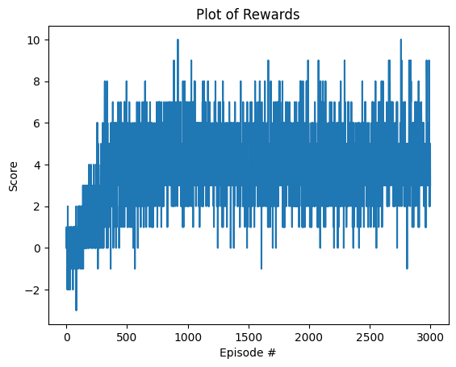
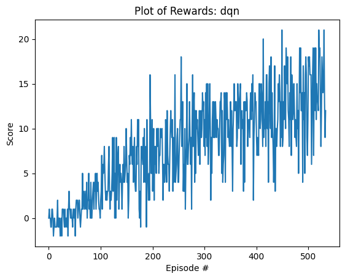
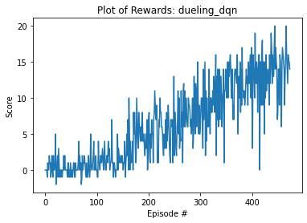

# Project 1: Navigation with Deep Q Learning

## [evaluate.py](src/evaluate.py)

```
conda activate drlnd
~/.anaconda3/envs/drlnd/bin/python src/evaluate.py
```

This shows the basic agent-environment interaction loop using a pretrained model


## [train.py](src/train.py)

```
conda activate drlnd
~/.anaconda3/envs/drlnd/bin/python src/train.py
```

Training simulates upto 5000 episodes with 1000 timesteps each. 
- For each episode a game state trajectory is recorded and added to the ReplayBuffer
- If `use_future_reward=True` then epsilon decayed future rewards for the trajectory are added 
    - Using future rewards improves early training speed, but doesn't seem to increase the maximum score
  to experience training data, but training is delayed until after the episode has completed
- The neural network is trained with a minibatch of 64 experiences every 4 timesteps

## [src/model.py](src/model.py) + [src/dqn_agent.py](src/dqn_agent.py)

The DQN Agent 
- Uses epsilon-greedy action selection, which decays throughout the training from 1 ^ 0.995 for each episode
- Optionally implements a Dueling DQN architecture, with two separate value and advantage heads 
  which are combined back together
- Dueling DQN with 1000 timesteps reaches average score of 13 slightly in less episodes (374 vs 436) but requires
  the same amount of compute power


# Plot of Rewards

If `max_t` is limited to only `100` timesteps, then the plot of rewards shows the network starts 
with an average score of 0 and eventually converges to an average score of around 5 around 1500 episodes, 
with similar results for both basic DQN and Dueling DQN networks and training for extended periods of time
does not seem to improve this.



To achieve a score of 13+ requires increasing `max_t` to a higher number such as `1000`, to allow the agent time to
collect additional bananas.






# Ideas for Future Work

Main difficulty at the moment is getting the DQN to converge towards
an increasing score. 

If this basic element could be achieved, then it might be worth attempting to optimize this score using the various components of a Rainbow DQN:
- Dueling Network Architecture (DONE)
- Double DQN 
- Prioritised Experience Replay
- Multi-step Returns
- Distributional RL 
- Noisy Nets
