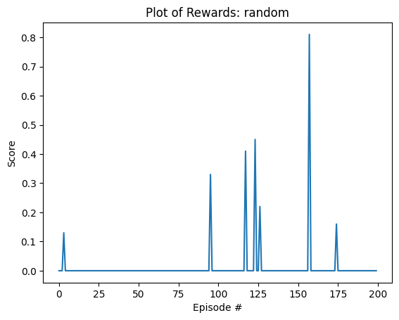

# Project 2: Continuous Control

See Also:
- [INSTALL.md](INSTALL.md)
- [README.md](README.md)
- [RUBRIC.md](RUBRIC.md)


## Random Agent

```
$ python3 src/test_random_bot.py
```

This is a baseline agent mostly for the purposes of testing the training loop code.

It achieves an average score of 0.0625, but occasionally scores as high as 0.9. 
Performance is random and doesn't improve over time.


